# Android界面组件实验

## 一、 实验目的
1.  **掌握 Android 常用 UI 控件的使用**：熟练使用 Button, TextView, ImageView, EditText 等基本控件构建界面。
2.  **掌握菜单 (Menu) 的创建与使用**：
    *   学习 Options Menu (选项菜单) 的自定义布局与事件处理。
    *   学习 Context Menu (上下文菜单) 及 Action Mode (操作模式) 的实现，特别是针对 ListView 的多选操作。
3.  **掌握对话框 (Dialog) 的高级用法**：
    *   能够使用 AlertDialog.Builder 创建标准对话框。
    *   掌握自定义布局对话框 (Custom Layout Dialog) 的实现，包括输入验证、交互逻辑及界面跳转。
4.  **掌握列表控件 (ListView) 与适配器 (Adapter) 的使用**：
    *   理解 Adapter 模式，熟练使用 SimpleAdapter 将数据绑定到 ListView。
    *   掌握 ListView 的点击事件监听 (OnItemClickListener)。
5.  **掌握 Android 消息提示与通知机制**：
    *   熟练自定义 Toast (吐司) 的布局与显示。
    *   掌握 Notification (通知) 的发送、权限处理 (Android 13+)、大图样式 (LargeIcon) 及点击跳转 (PendingIntent)。

## 二、 实验任务

1、Android ListView的用法（利用SimpleAdapter实现列表项界面布局效果）

(1)实现如下图的效果

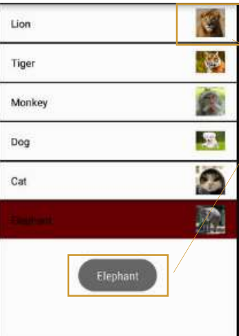

(2)使用Toast显示选中的列表项信息,并且任意一个列表项被选中后都会变成红色

(3)单击某个列表项后，发送一条通知，通知的图片（Icon）为应用程序图标，显示的Title为列表项内容，通知内容自拟。

2、创建自定义布局的AlertDialog

(1)创建如图所示的自定义对话框

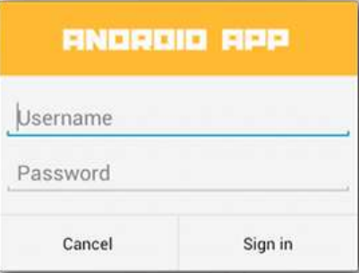

(2)调 用 AlertDialog.Builder 对 象 上 的 setView() 将 布 局 添 加 到 AlertDialog。

3、使用XML定义菜单

(1)字体大小（有小，中，大这3个选项；分别对应10号字，16号字和20号字）；点击之后设置测试文本的字体

(2)普通菜单项，点击之后弹出Toast提示

(3)字体颜色（有红色和黑色这2个选项），点击之后设置测试文本的字体

(4)实现效果


4、创建上下文操作模式(ActionMode)的上下文菜单

(1)使用ListView或者ListActivity创建List

(2)为List Item创建ActionMode形式的上下文菜单

(3)实现效果

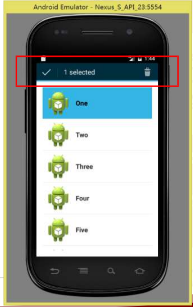

## 三、 实验环境
Android Studio

SDK : API 24

Java语言

PC一台

## 四、 实验步骤与实验结果
### 1、设计主界面，其包含进入SimpleAdapter、进入AlertDialog、进入MenuTest、进入ActionMode的用户交互按钮，按钮呈竖直方向线性排列。

**核心代码**

```java
    @Override
    protected void onCreate(Bundle savedInstanceState) {
        super.onCreate(savedInstanceState);
        EdgeToEdge.enable(this);
        setContentView(R.layout.activity_main);
        ViewCompat.setOnApplyWindowInsetsListener(findViewById(R.id.main), (v, insets) -> {
            Insets systemBars = insets.getInsets(WindowInsetsCompat.Type.systemBars());
            v.setPadding(systemBars.left, systemBars.top, systemBars.right, systemBars.bottom);
            return insets;
        });

        Button btnMenuTest = findViewById(R.id.btn_menu_test);
        btnMenuTest.setOnClickListener(new View.OnClickListener() {
            @Override
            public void onClick(View v) {
                Intent intent = new Intent(MainActivity.this, OptionMenuActivity.class);
                startActivity(intent);
            }
        });

        Button btnAlertDialog = findViewById(R.id.btn_alert_dialog);
        btnAlertDialog.setOnClickListener(new View.OnClickListener() {
            @Override
            public void onClick(View v) {
                Intent intent = new Intent(MainActivity.this, AlertDialogActivity.class);
                startActivity(intent);
            }
        });

        Button btnActionMode = findViewById(R.id.btn_action_mode);
        btnActionMode.setOnClickListener(new View.OnClickListener() {
            @Override
            public void onClick(View v) {
                Intent intent = new Intent(MainActivity.this, ActionModeActivity.class);
                startActivity(intent);
            }
        });

        Button btnSimpleAdapter = findViewById(R.id.btn_simple_adapter);
        btnSimpleAdapter.setOnClickListener(new View.OnClickListener() {
            @Override
            public void onClick(View v) {
                Intent intent = new Intent(MainActivity.this, SimpleAdapterActivity.class);
                startActivity(intent);
            }
        });
    }
```

**界面效果**

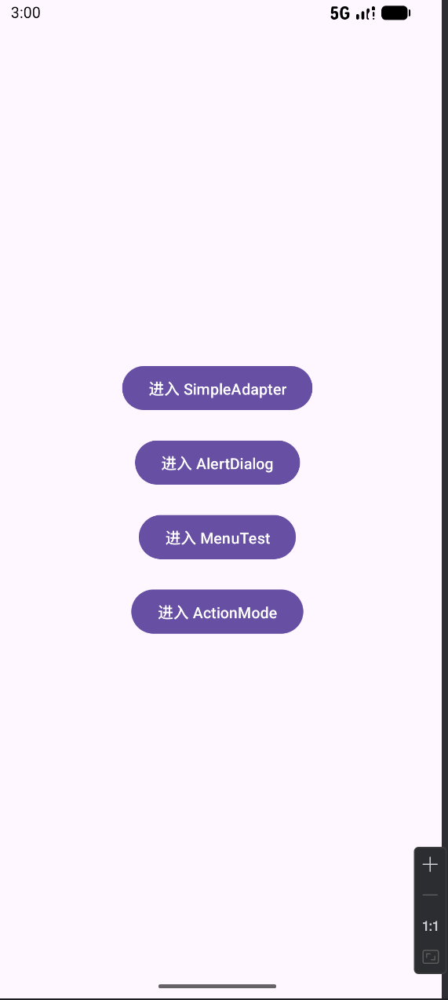

### 2、ListView的用法(利用SimpleAdapter实现列表界面效果)

**设计思路**

- 使用 ListView + SimpleAdapter ，数据源为 List<Map<String,Object>> ，键值对与列表项布局中的 TextView / ImageView 一一映射
- 点击项后：高亮为红色，2秒后恢复；弹出自定义 Toast；发送系统通知（大图标为动物图片），点击通知返回列表界面
- 通知在 Android 8.0+ 使用通知渠道；Android 13+ 运行时请求 POST_NOTIFICATIONS 权限

**核心代码**

```java
// 1) 数据与映射 39–47, 71–77
private String[] names = {"Lion","Tiger","Monkey","Dog","Cat","Elephant"};
private int[] images = {R.drawable.lion,R.drawable.tiger,R.drawable.monkey,
                        R.drawable.dog,R.drawable.cat,R.drawable.elephant};

List<Map<String,Object>> listItems = new ArrayList<>();
for (int i = 0; i < names.length; i++) {
    Map<String,Object> m = new HashMap<>();
    m.put("name", names[i]);
    m.put("image", images[i]);
    listItems.add(m);
}
SimpleAdapter adapter = new SimpleAdapter(
    this, listItems, R.layout.item_animal,
    new String[]{"name","image"}, new int[]{R.id.tv_name, R.id.iv_image}
);
listView.setAdapter(adapter);

// 2) 点击事件：高亮/Toast/通知 81–105
listView.setOnItemClickListener((parent, view, position, id) -> {
    view.setBackgroundColor(Color.RED);
    new Handler().postDelayed(() -> view.setBackgroundColor(Color.TRANSPARENT), 2000);
    Map<String,Object> item = (Map<String,Object>) parent.getItemAtPosition(position);
    String name = (String) item.get("name");
    int imageResId = (int) item.get("image");
    showCustomToast(name);
    sendNotification(name, imageResId, position);
});

// 3) 通知：LargeIcon=动物图片，点击返回列表 126–162
Intent intent = new Intent(this, SimpleAdapterActivity.class);
intent.setFlags(Intent.FLAG_ACTIVITY_NEW_TASK | Intent.FLAG_ACTIVITY_CLEAR_TOP | Intent.FLAG_ACTIVITY_SINGLE_TOP);
PendingIntent pi = PendingIntent.getActivity(this, notificationId, intent,
        PendingIntent.FLAG_UPDATE_CURRENT | PendingIntent.FLAG_IMMUTABLE);

Bitmap largeIcon = BitmapFactory.decodeResource(getResources(), imageResId);
Notification n = new NotificationCompat.Builder(this, "animal_channel")
        .setSmallIcon(R.mipmap.ic_launcher)
        .setLargeIcon(largeIcon)
        .setContentTitle(title)
        .setContentText("You clicked on " + title)
        .setAutoCancel(true)
        .setContentIntent(pi)
        .build();
notificationManager.notify(notificationId, n);
```

易错点

- SimpleAdapter 的键名与布局控件 ID需严格对应： "name"→R.id.tv_name ， "image"→R.id.iv_image
- 通知的小图标建议使用应用图标；动物图片放在 LargeIcon 才能显示为彩色大图
- Android 13+ 未授予通知权限将收不到通知；需同意系统弹窗
- 通知 ID需唯一（使用 position ），否则后发覆盖先发

**操作流程与实现效果**

(1)点击主界面的进入SimpleAdapter用户交互按钮，进入ListView界面

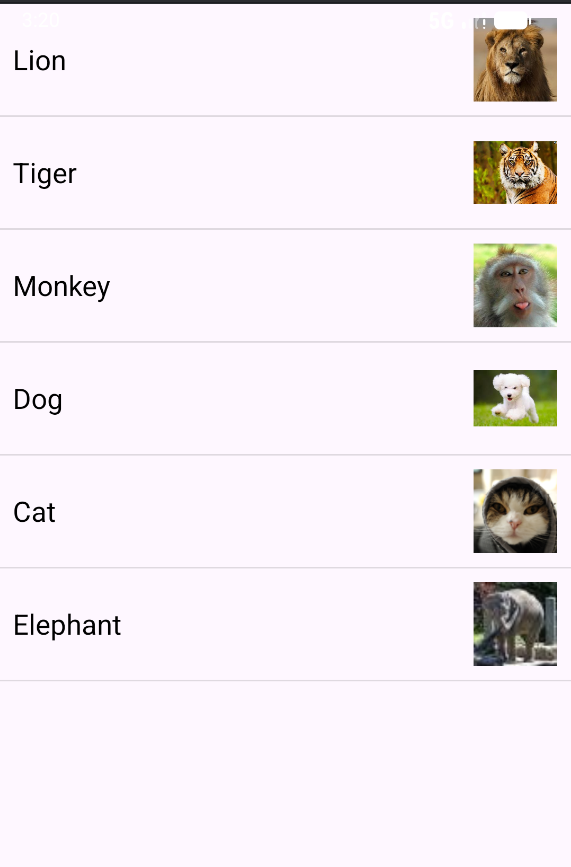

(2)点击任一列表项，查看效果

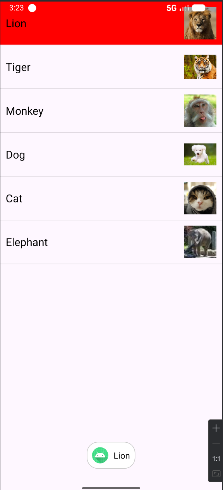

可以看到，被选中的列表项变成了红色，同时Toast显示了其相应的信息

(3)接下来，下拉手机上方查看消息通知栏，这边每个列表项都点击一遍查看效果

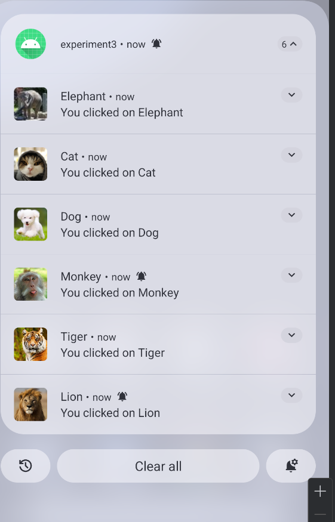

根据结果可以得出，只要点击了任一列表项，程序就会发一条通知并且通知包含该列表项的头像图标，标题显示了列表项的内容

### 3、创建自定义布局的AlertDialog

**设计思路**

- 使用一个专门的页面 AlertDialogActivity 作为承载容器，进入该页面后立即弹出自定义布局的对话框。页面本身不展示内容，用户操作完毕后返回主界面。
- 对话框布局使用 alert_dialog.xml ，包含标题、用户名与密码输入框、两个按钮（Cancel/Sign in）。
- 交互规则：
- Cancel：关闭对话框并结束 AlertDialogActivity ，返回主界面
- Sign in：校验空输入；仅当用户名为 hft 且密码为 123456 时登录成功，弹出提示并返回主界面；否则提示错误

**功能实现**

- 页面进入即弹出对话框：在 AlertDialogActivity.onCreate 中调用 showLoginDialog
- 自定义布局：通过 LayoutInflater 加载 alert_dialog.xml 并 builder.setView(...)
- 禁止外部取消： builder.setCancelable(false) ，确保用户必须点击按钮进行处理
- 事件绑定：为 Cancel 和 Sign in 设置点击处理逻辑（空校验、匹配校验、Toast 提示、关闭与返回）

**核心代码**

```java
    @Override
    protected void onCreate(Bundle savedInstanceState) {
        super.onCreate(savedInstanceState);
        setContentView(R.layout.activity_alert_dialog);
        showLoginDialog();
    }

    private void showLoginDialog() {
        AlertDialog.Builder builder = new AlertDialog.Builder(this);
        LayoutInflater inflater = getLayoutInflater();
        View dialogView = inflater.inflate(R.layout.alert_dialog, null);
        builder.setView(dialogView);
        builder.setCancelable(false);
        final AlertDialog dialog = builder.create();

        EditText etUsername = dialogView.findViewById(R.id.username);
        EditText etPassword = dialogView.findViewById(R.id.password);
        Button btnLogin = dialogView.findViewById(R.id.btn_login);
        Button btnCancel = dialogView.findViewById(R.id.btn_cancel);

        btnCancel.setOnClickListener(v -> {
            dialog.dismiss();
            finish();
        });

        btnLogin.setOnClickListener(v -> {
            String username = etUsername.getText().toString().trim();
            String password = etPassword.getText().toString().trim();
            if (TextUtils.isEmpty(username) || TextUtils.isEmpty(password)) {
                Toast.makeText(this, "输入内容不能为空", Toast.LENGTH_SHORT).show();
                return;
            }
            if ("hft".equals(username) && "123456".equals(password)) {
                Toast.makeText(this, "登录成功", Toast.LENGTH_SHORT).show();
                dialog.dismiss();
                finish();
            } else {
                Toast.makeText(this, "用户名或密码错误", Toast.LENGTH_SHORT).show();
            }
        });

        dialog.show();
    }
```

**操作流程与实现效果**

(1)点击主界面的进入AlertDialog用户交互按钮，进入对话框界面

一进入马上弹出一个对话框如下图所示

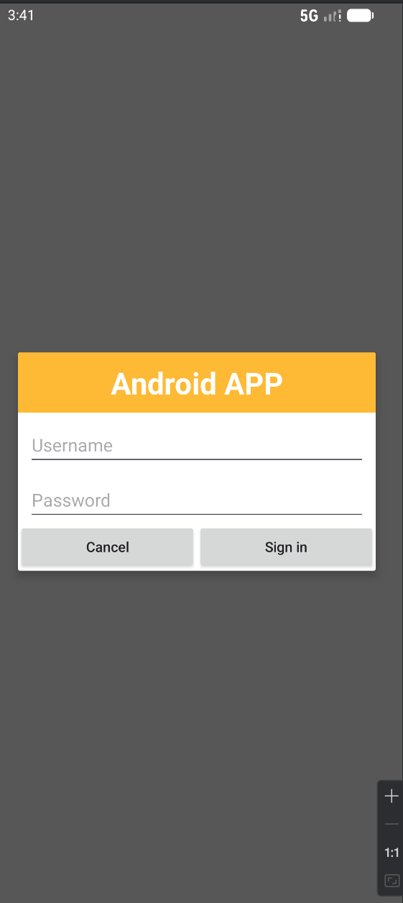

(2)如果不输入或输入空白字符点击Sign in按钮，系统将给出错误提示(输入内容不能为空)；如果用户名和密码都已输入，但是其不符合**用户名 == hft && 密码 == 123456**，系统也会给出错误提示(用户名或密码错误)；只有当用户输入的用户名 == hft 并且 密码 == 123456时，用户才能成功登录，此时系统还会用Toast进行提示登录成功，之后返回主界面。

直接点击Sign in按钮的效果


输入空白字符的效果

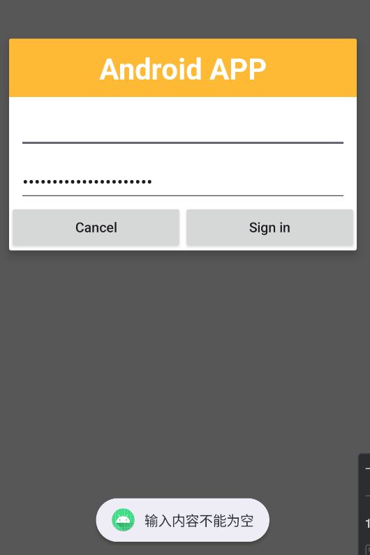

用户名和密码都已输入，但是其不符合**用户名 == hft && 密码 == 123456**的效果

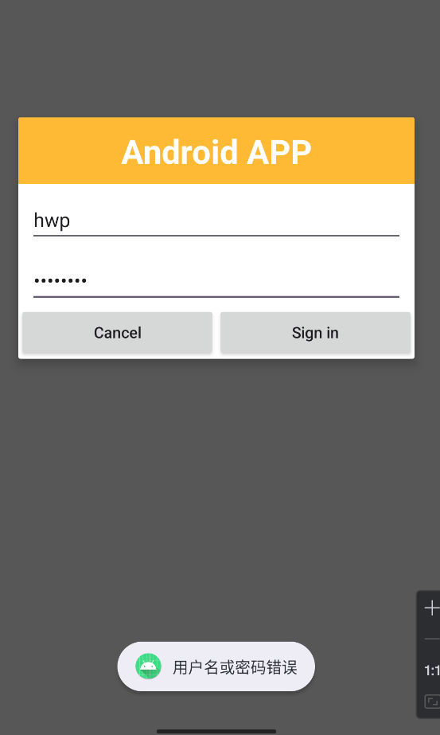

当用户名 == hft 并且 密码 == 123456时的效果

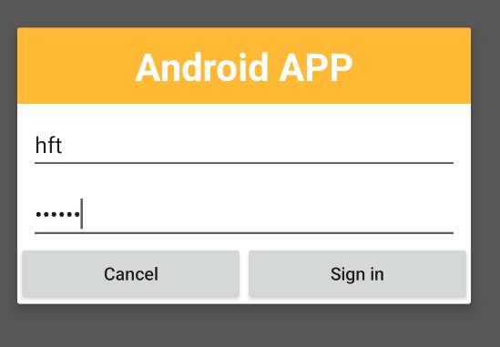

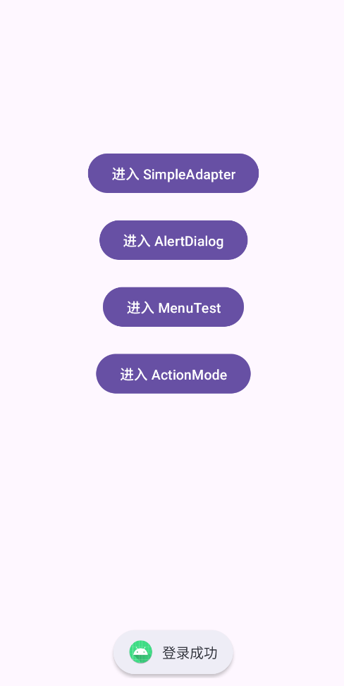

从上面的结果可以看出，该对话框设计了错误提示功能，同时对用户输入的密码进行了加密处理，不会直接显示出来。

(3)如果用户不想登录或者用户不知道用户名和密码，那么只有点击Cancel按钮才能返回主界面。

### 4、使用XML定义菜单

**设计思路**

- 功能目标：模拟 App 标题栏右侧的“三点”更多按钮，点击后弹出选项菜单，改变界面中文本的大小和颜色。
- 架构：
  - options_menu.xml ：自定义标题栏布局，包含一个 TextView (内容区) 和一个 ImageView (三点菜单图标)。
  - xml_menu.xml ：在 res/menu/ 下定义的菜单结构，包含字体大小组、普通项、字体颜色组。
  - OptionMenuActivity ：使用 PopupMenu 将菜单资源与图标点击事件绑定，处理菜单项选择逻辑。

**功能实现**

- 菜单定义：使用 XML 的 menu,item,group标签构建嵌套菜单。
- 弹出逻辑：点击右上角图标时，实例化 PopupMenu ，使用 getMenuInflater().inflate 加载 XML 菜单。
- 事件响应： setOnMenuItemClickListener 监听选择，根据 ID 修改 tvContent 的 TextSize 或 TextColor 。

**核心代码**

```java
package com.hft.experiment3;

import android.graphics.Color;
import android.os.Bundle;
import android.view.View;
import android.widget.PopupMenu;
import android.widget.TextView;
import android.widget.Toast;
import androidx.appcompat.app.AppCompatActivity;

public class OptionMenuActivity extends AppCompatActivity {
    private TextView tvContent;

    @Override
    protected void onCreate(Bundle savedInstanceState) {
        super.onCreate(savedInstanceState);
        setContentView(R.layout.options_menu);

        tvContent = findViewById(R.id.tv_content);
        findViewById(R.id.iv_menu_icon).setOnClickListener(v -> showPopupMenu(v));
    }

    private void showPopupMenu(View view) {
        PopupMenu popupMenu = new PopupMenu(this, view);
        popupMenu.getMenuInflater().inflate(R.menu.xml_menu, popupMenu.getMenu());
        
        popupMenu.setOnMenuItemClickListener(item -> {
            int id = item.getItemId();
            if (id == R.id.font_10) tvContent.setTextSize(10);
            else if (id == R.id.font_16) tvContent.setTextSize(16);
            else if (id == R.id.font_20) tvContent.setTextSize(20);
            else if (id == R.id.red_font) tvContent.setTextColor(Color.RED);
            else if (id == R.id.black_font) tvContent.setTextColor(Color.BLACK);
            else if (id == R.id.plain_item) Toast.makeText(this, "普通菜单项", Toast.LENGTH_SHORT).show();
            return true;
        });
        popupMenu.show();
    }
}
```

**操作流程与实现效果**

(1)点击主界面的进入MenuTest用户交互按钮，进入XML定义的菜单界面

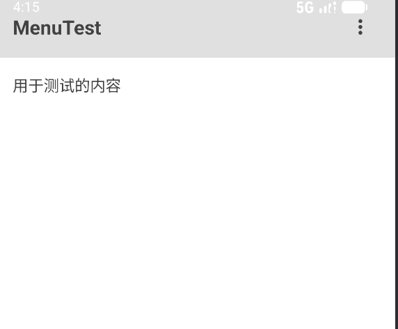

(2)点击右上角的三个点图标按钮，将显示出菜单，其包含三个菜单项(字体大小、普通菜单项、字体颜色)，其中两个属于子菜单(字体大小、字体颜色)

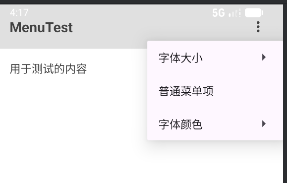

(3)点击字体大小子菜单，将显示出三个菜单项(小、中、大)，然后依次选择字体大小为小、中、大后**用于测试的内容**呈现的效果

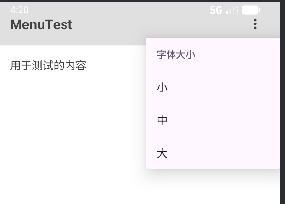

选择字体大小为小的效果

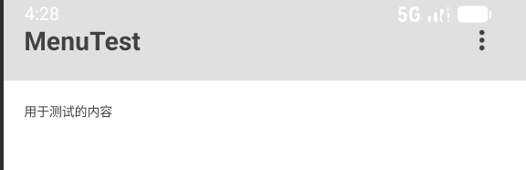

选择字体大小为中的效果

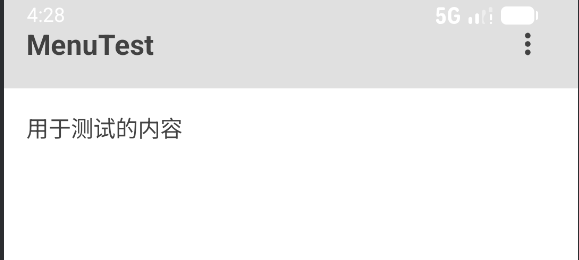

选择字体大小为大的效果

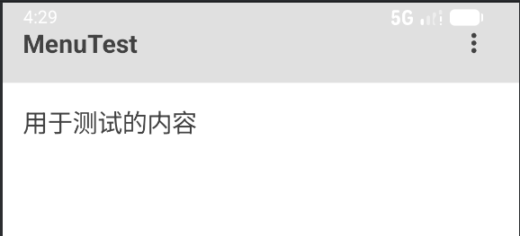

(4)点击普通菜单项后呈现的效果

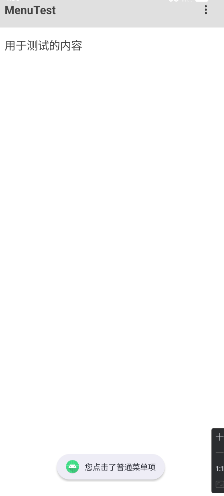

可以看出系统用Toast弹出了 您点击了普通菜单项 的提示

(5)点击字体颜色子菜单，将显示出两个菜单项(红色、黑色),然后依次选择字体颜色为红色、黑色后**用于测试的内容**呈现的效果

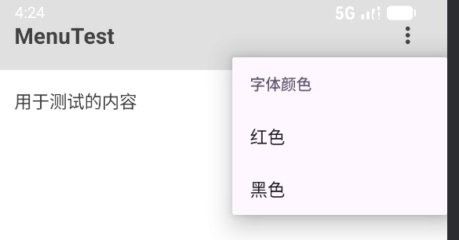

选择字体颜色为红色的效果

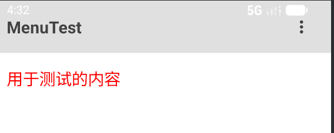

选择字体颜色为黑色的效果

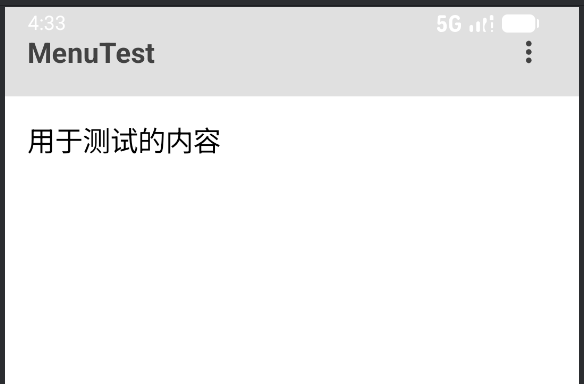

### 5、创建上下文操作模式(ActionMode)的上下文菜单

**设计思路**

- 目标：实现长按列表项进入“上下文操作模式”（Action Mode），支持多选并批量删除。
- 架构：
  - ActionModeActivity ：主逻辑，配置 ListView 启用 CHOICE_MODE_MULTIPLE_MODAL 。
  - MultiChoiceModeListener ：核心监听器，处理进入模式、菜单点击（删除操作）、选中状态变化（更新标题）。
  - context_menu.xml ：定义 Action Mode 顶部的菜单项（如删除图标）。

**功能实现**

- 启用多选模态 ： listView.setChoiceMode(ListView.CHOICE_MODE_MULTIPLE_MODAL) 。
- 监听器实现 ：
- onCreateActionMode ：加载 context_menu.xml （显示删除按钮）。
- onItemCheckedStateChanged ：每次点击更新 Action Bar 标题（显示 "X selected"）。
- onActionItemClicked ：点击删除按钮时，遍历 checkedItemPositions 删除对应数据，刷新列表并退出模式。
- 视图适配 ： MyAdapter 中根据 listView.isItemChecked(position) 改变背景色（高亮选中项）。

**核心代码**

Activity 与 监听器逻辑

```java
listView.setChoiceMode(ListView.CHOICE_MODE_MULTIPLE_MODAL);
listView.setMultiChoiceModeListener(new AbsListView.MultiChoiceModeListener() {
    @Override
    public boolean onCreateActionMode(ActionMode mode, Menu menu) {
        getMenuInflater().inflate(R.menu.context_menu, menu);
        return true;
    }

    @Override
    public void onItemCheckedStateChanged(ActionMode mode, int position, long id, boolean checked) {
        mode.setTitle(listView.getCheckedItemCount() + " selected");
        adapter.notifyDataSetChanged(); // 刷新视图以更新背景高亮
    }

    @Override
    public boolean onActionItemClicked(ActionMode mode, MenuItem item) {
        if (item.getItemId() == R.id.menu_delete) {
            // 遍历并删除选中项
            SparseBooleanArray checked = listView.getCheckedItemPositions();
            List<String> toDelete = new ArrayList<>();
            for (int i = 0; i < checked.size(); i++) {
                if (checked.valueAt(i)) toDelete.add(dataList.get(checked.keyAt(i)));
            }
            dataList.removeAll(toDelete);
            adapter.notifyDataSetChanged();
            mode.finish(); // 退出 Action Mode
            return true;
        }
        return false;
    }
    // ... 其他方法
});
```

Adapter 视图高亮处理

```java
// 在 getView 方法中
if (listView.isItemChecked(position)) {
    convertView.setBackgroundColor(getResources().getColor(android.R.color.holo_blue_light));
} else {
    convertView.setBackgroundColor(getResources().getColor(android.R.color.transparent));
}
```

**操作流程与实现效果**

(1)点击主界面的进入ActionMode用户交互按钮，进入上下文菜单界面


(2)长按任意一个列表项，将会选中此列表项，然后启动上下文菜单,同时此列表项的颜色变成蓝色

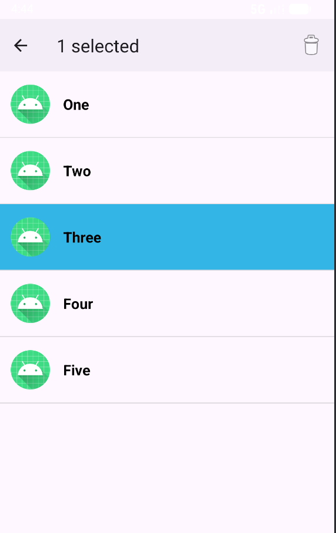

(3)继续单击其他列表项，则被单击后的列表项也被选中，并在最上方显示选中的列表项个数

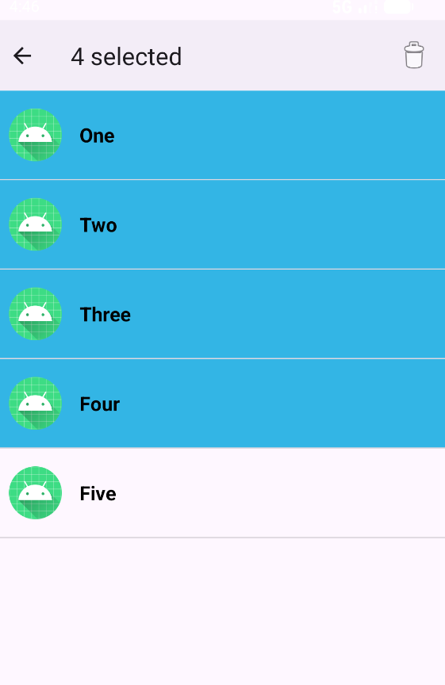

(4)点击右上角垃圾桶图标按钮，便可删除选中的列表项，成功删除后会用Toast进行提示

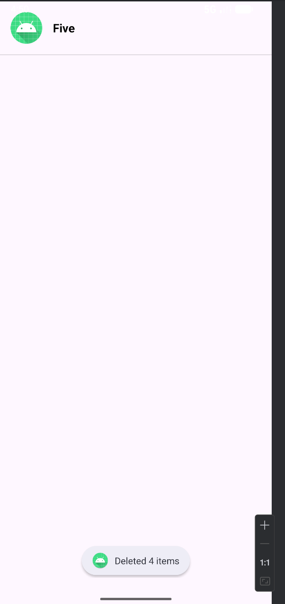

## 总结与探讨
1、遇到的问题及解决方案

(1) AlertDialog 的显示形式与交互逻辑

- 问题描述 ：最初将 AlertDialog 作为一个独立的 Activity 处理，导致页面跳转过于生硬，且无法像原生对话框一样悬浮在 MainActivity 之上。同时，默认的按钮文本会自动转换为大写，密码输入框明文显示。
- 解决方案 ：
  - 采用 AlertDialog.Builder 结合 LayoutInflater 动态加载 alert_dialog.xml 布局，使其作为模态窗口显示。
  - 在 XML 中设置 android:textAllCaps="false" 解决按钮大写问题，设置 android:inputType="textPassword" 实现密码脱敏。
  - 通过 setCancelable(false) 强制用户必须点击按钮才能关闭，并在点击事件中加入 finish() 逻辑以正确返回。

(2) Notification (通知) 的多条显示与图标定制

- 问题描述 ：连续点击列表项发送通知时，新通知覆盖了旧通知（只显示最后一条）；且通知图标默认显示为机器人（系统图标），未显示对应的动物图片；点击通知后无法跳转回列表页面。
- 解决方案 ：
  - 多条并存 ：在调用 notify(id, notification) 时，使用列表项的 position 作为唯一的 Notification ID，确保每条通知独立存在。
  - 图标显示 ：使用 BitmapFactory.decodeResource 将资源图片转为 Bitmap，并通过 setLargeIcon() 设置为通知的大图标。
  - 跳转逻辑 ：构建 Intent 指向 SimpleAdapterActivity ，并封装为 PendingIntent （设置 FLAG_UPDATE_CURRENT | FLAG_IMMUTABLE ），将其赋值给setContentIntent。

(3) ListView 的交互反馈与上下文菜单

- 问题描述 ：在实现 ActionMode（多选删除）时，难以获取用户选中的具体数据项；在普通点击变色功能中，背景色无法自动恢复。
- 解决方案 ：
  - 多选删除 ：在 onActionItemClicked 中使用 listView.getCheckedItemPositions() 获取 SparseBooleanArray ，遍历键值对确定选中项索引，并从数据源中移除。
  - 延时恢复 ：利用 Handler().postDelayed() 方法，在点击事件触发 2秒后将 View 背景色重置为透明，实现瞬时的高亮反馈效果。

  2、收获与总结

  通过本次实验，深入理解了 Android 界面交互的核心机制，具体收获如下：

1. 菜单系统（Menu System）的全面掌握
   
   - 区分了 Options Menu （选项菜单）与 Context Menu/Action Mode （上下文菜单）的应用场景。
   - 学会了使用 XML 定义菜单结构（ group , item , menu 嵌套），以及如何在代码中通过 MenuInflater 加载菜单。
   - 特别是掌握了 ListView 的 MultiChoiceModeListener ，实现了类似邮件管理的批量操作交互，提升了用户体验。
2. 自定义 UI 组件的能力提升
   
   - 不再局限于系统默认的样式。通过 LayoutInflater ，能够将自定义的 XML 布局文件（如 alert_dialog.xml , toast_custom.xml ）实例化为 View 对象，并应用到 AlertDialog 和 Toast 中，极大地丰富了界面的表现力。
3. 适配器模式（Adapter Pattern）的实践
   
   - 熟练使用了 SimpleAdapter 将静态数据（List<Map<String, Object>>）映射到复杂的列表项布局（左文右图）中。理解了 Adapter 在数据源与视图层之间的桥梁作用。
4. 系统服务与通知机制
   
   - 掌握了 Android 8.0+ 的通知渠道（NotificationChannel）创建流程。
   - 理解了 PendingIntent 的延迟执行特性，实现了从系统通知栏反向唤起应用指定页面的功能，这是 App 促活和交互闭环的重要手段。
5. 布局管理的灵活性
   
   - 在 options_menu.xml 等布局中，熟练运用 ConstraintLayout 进行相对定位，解决了复杂界面下的层级嵌套问题，使布局更加扁平化和高效。

总结 ：本次实验不仅实现了预期的功能模块，更重要的是打通了“布局绘制 -> 事件监听 -> 逻辑处理 -> 系统反馈”的完整开发链路，为后续开发更复杂的 Android 应用奠定了坚实基础。